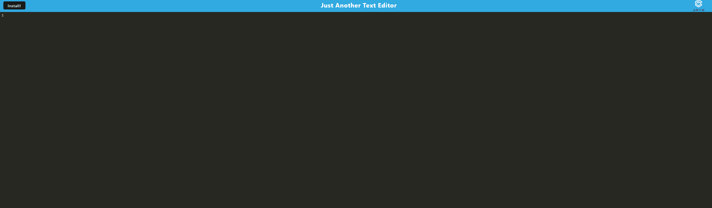

# TextEditor

# table of Contents:
  - [Description](#description)
  - [Installation](#installation)
  - [Usage](#usage)
  - [Contributing](#contributing)
  - [Tests](#tests)
  - [Questions](#questions)
  
  ##description:
    this project I had to utilize implementation methods for getting and storing data to an IndexedDB database

    ##installation:
    idb 

    ##usage:
    this will be used to generate a text editor app that will allow you to add and edit text

   

    ##contribution:
    no one else

    ##test:
    none

    ##github:  
    https://github.com/garrettj94/
  
    ##email:
    garrettjackson43@gmail.com

    ##heroku: 
    https://secure-gorge-60354.herokuapp.com/

  <>